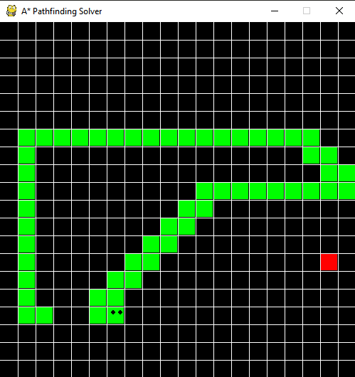

# Python-Snake-Solvers
A Repository of Different Automated Snake Solving Scripts

 

**The repository contains:**
- The basic snake game
- A Snake solver which uses A* pathfinding to get the shortest path to the apple
- A Snake solver which uses a hamiltonian cycle on a 6x6 grid
  -  This method always leads the snake to a win as the snake can never hit itself
- A Snake solver which uses NEAT to train a single snake 

**Issues:**
- The A* solver can trap itself, or crash due to iterating too many times (even if there is still a path)
  -  I have not found a solution to this so I have caused the program to exit if these occur
- The Hamiltonian cycle causes the snake to have to traverse 1296 cubes on a 6x6 grid, and on a 20x20 grid it has to traverse 160,000 cubes
  -This is extremely inefficient, however it has a 100% success rate
- The Snake AI only trains one snake at a time and the reward system is flawed

